# 1.ZooKeeper 概述

​		ZooKeeper 是一个分布式协调服务的开源框架。主要用来**解决分布式集群中应用系统的一致性**的问题（例如怎样避免同时操作同一数据造成脏读的问题）。ZooKeeper 本质上是一个**分布式的小文件存储系统**。提供基于类似于文件系统的目录树方式的数据存储，并且可以对树种 的节点进行有效管理。从而来维护和监控存储的数据的状态变化。将通过监控这些数据状态的变化，从而可以达到基于数据的集群管理：统一命名服务（dubbo）、分布式配置管理（solr的配置集中管理）、分布式消息队列（sub/pub）、分布式锁、分布式协调等功能。

# 2.架构及角色

### 2.1 架构图

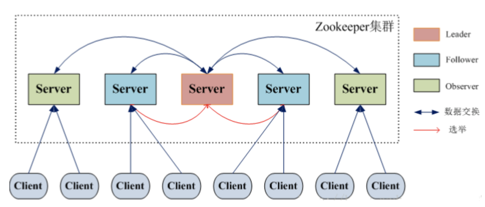

### 2.2 文件结构

下图描述了用于内存表示的ZooKeeper文件系统的树结构。ZooKeeper节点称为 **znode** 。每个znode由一个名称标识，并用路径(/)序列分隔：

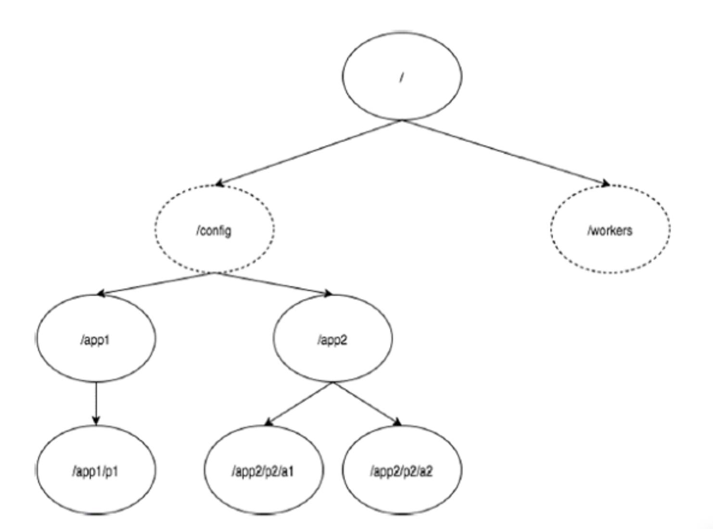

- 在图中，首先有一个由“/”分隔的znode。在根目录下，你有两个逻辑命名空间 **config** 和 **workers** 。
- **config** 命名空间用于集中式配置管理，**workers** 命名空间用于命名。
- 在 **config** **命名空间下**，每个znode最多可存储`1MB`的数据。这与UNIX文件系统相类似，除了父znode也可以存储数据。这种结构的主要目的是**存储同步数据并描述znode的元数据**。此结构称为 **ZooKeeper数据模型**。

Znode兼具文件和目录两种特点。既像文件一样维护着数据长度、元信息、ACL、时间戳等数据结构，又像目录一样可以作为路径标识的一部分。每个Znode由三个部分组成：

- **stat**：状态信息，描述该Znode版本、权限等信息。
- **data**：与该Znode关联的数据
- **children**：该Znode下的节点

相关术语：

- **版本号** - 每个znode都有版本号，每当与znode相关联的数据发生变化时，其对应的版本号也会增加。当多个zookeeper客户端尝试在同一znode上执行操作时，版本号的使用就很重要。
- **操作控制列表(ACL)** - ACL基本上是访问znode的认证机制。它管理所有znode读取和写入操作。
- **时间戳** - 时间戳表示创建和修改znode所经过的时间。它通常以毫秒为单位。ZooKeeper从“事务ID"(zxid)标识znode的每个更改。**Zxid** 是唯一的，并且为每个事务保留时间，以便你可以轻松地确定从一个请求到另一个请求所经过的时间。
- **数据长度** - 存储在znode中的数据总量是数据长度。你最多可以存储1MB的数据。

**Znode 类型**：

- **持久节点** - 即使在创建该特定znode的客户端断开连接后，持久节点仍然存在。默认情况下，除非另有说明，否则**所有znode都是持久的**。
- **临时节点** - 客户端活跃时，临时节点就是有效的。当客户端与ZooKeeper集合断开连接时，临时节点会自动删除。因此，**只有临时节点不允许有子节点**。如果临时节点被删除，则下一个合适的节点将填充其位置。临时节点在leader选举中起着重要作用。
- **顺序节点** - 顺序节点可以是持久的或临时的。当一个新的znode被创建为一个顺序节点时，ZooKeeper通过将10位的序列号附加到原始名称来设置znode的路径。例如，如果将具有路径 **/myapp** 的znode创建为顺序节点，则ZooKeeper会将路径更改为 **/myapp0000000001** ，并将下一个序列号设置为0000000002。如果两个顺序节点是同时创建的，那么ZooKeeper不会对每个znode使用相同的数字。顺序节点在锁定和同步中起重要作用。

**会话（Session）：**

会话对于ZooKeeper的操作非常重要。会话中的请求按FIFO顺序执行。一旦客户端连接到服务器，将建立会话并向客户端分配**会话ID** 。

客户端以特定的时间间隔发送**心跳**以保持会话有效。如果ZooKeeper集合在超过服务器开启时指定的期间（会话超时）都没有从客户端接收到心跳，则它会判定客户端死机。

会话超时通常以毫秒为单位。当会话由于任何原因结束时，在该会话期间创建的临时节点也会被删除。

**监视（Watches）：**

监视是一种简单的机制，使客户端收到关于ZooKeeper集合中的更改的通知。客户端可以在读取特定znode时设置Watches。Watches会向注册的客户端发送任何znode（客户端注册表）更改的通知。

Znode更改是与znode相关的数据的修改或znode的子项中的更改。只触发一次watches。如果客户端想要再次通知，则必须通过另一个读取操作来完成。当连接会话过期时，客户端将与服务器断开连接，相关的watches也将被删除。

### 2.3 角色

- Leader:Zookeeper 集群工作的核心事务（写操作）的唯一调度者和处理者，一个Zookeeper集群同一时间只会有一个实际工作的Leader，它会发起并维护与各Follwer及Observer间的心跳。所有的写操作（create、setData、delete）必须要转发给Leader处理再由Leader将写操作广播给其它服务器（这个过程称之为一个事务）。
- Follower：处理client 的非事务（读操作）请求、转发事务请求给 Leader，并参与集群Leader 的选举过程
- Observer：观察者角色，与 Follower 区别是不参与 Leader 选举过程，简单来说是为了增加并发请求的处理能力而设置。

### 2.3 原子广播（ZAB）

​		为了**保证写操作的一致性与可用性**，Zookeeper专门设计了一种名为原子广播（ZAB）的支持崩溃恢复的一致性协议。基于该协议，实现了一种主从模式的系统架构来保持集群中各个副本之间的数据一致性。

​		根据ZAB协议，**所有的写操作都必须通过Leader完成，Leader写入本地日志后再复制到所有的Follower节点。**

​		一旦Leader节点无法工作，ZAB协议能够自动从Follower节点中重新选出一个合适的替代者，即新的Leader，该过程即为**领导选举**。

### 2.5 写请求

- 写 Leader

  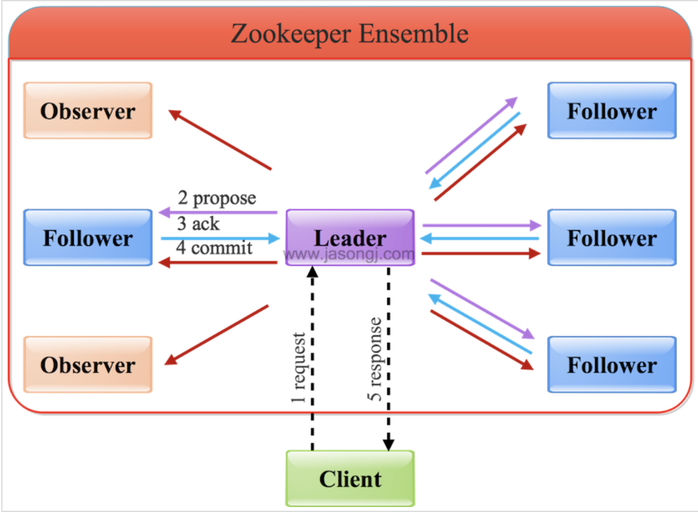

  - 客户端发起写请求
  - Leader将写请求以 Proposal 的形式发给所有的 Follower，然后等待 ACK
  - Follower 收到 Leader 的 Proposal 后返回 ACK
  - Leader 得到过半数的 ACK（默认自己有一个 ACK）后向所有的 Follower 和 Observer发送 Commit
  - Leader 将处理结果返回给 Client

  注意：

  ​	Observer没有投票权，因此不需要得到Observer 的 ACK。

  ​	Leader 只需要收到超过半数的 ACK 即可

  ​	Observer 虽然没有投票权，但是仍需同步 Leader 的数据

- 写 Follower/Observer

  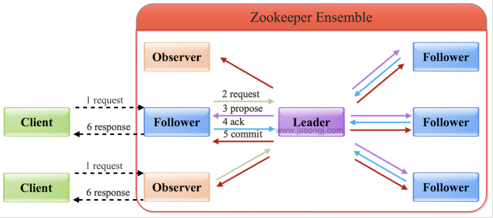

  - 只是多了一层转发给 Leader的过程

### 2.5 读请求

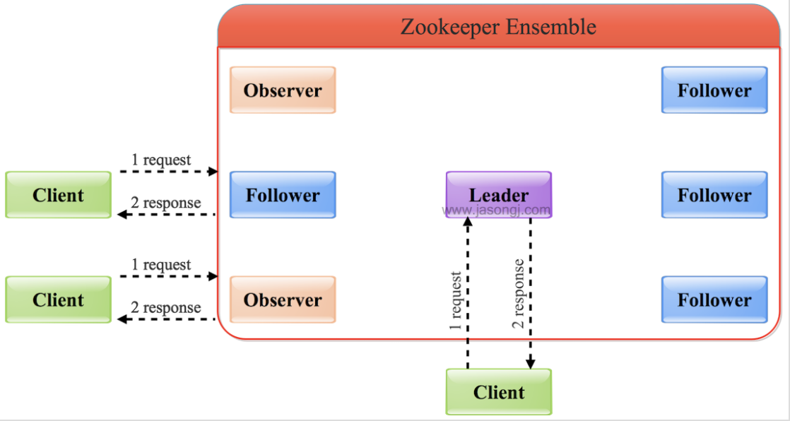

Leader/Follower/Observer都可直接处理读请求，从本地内存中读取数据并返回给客户端即可，Follower/Observer越多，整体可处理的读请求量越大，也即读性能越好。

# 3.ZooKeeper特性

1. 全局数据一致性：每个 Server 都保存有一份相同的数据副本，Client 无论连接到哪个Server，得到的数据都是一致的
2. 可靠性：如果消息被一台Server 接受，那么将被所有的 Server 接受
3. 顺序性：
   - 全局有序：一台 Server 上，若消息 a 在消息 b 之前发布，则在所有 Server 上消息 a 在消息 b 之前发布
   - 偏序：若一个消息 b 在消息 a 后被同一个 Server 发布，则 a 必须在 b 前面被发布
4. 数据更新原子性：一次数据更新要么成功，要么失败，不存在中间状态
5. 实时性：ZooKeeper 保证Client将在一个时间间隔范围内获得服务器的更新信息，或者服务器失效的信息

# 4.选举流程及算法

### 4.1 术语介绍

- myid：每个Zookeeper服务器，都需要在数据文件夹下创建一个名为myid的文件，该文件包含**整个Zookeeper集群唯一的ID**（整数）。

  - 例如某Zookeeper集群包含三台服务器，hostname分别为zoo1、zoo2和zoo3，其myid分别为1、2和3，则在配置文件中其ID与hostname必须一一对应,在该配置文件中，`server.`后面的数据即为myid

    ```sh
    server.1=zoo1:2888:3888
    server.2=zoo2:2888:3888
    server.3=zoo3:2888:3888
    ```

- zxid：事务ID，**用于标识一次更新操作的Proposal ID**。为了保证顺序性，zkid必须**单调递增**。因此Zookeeper使用一个64位的数来表示，高32位是Leader的epoch(分代)，从1开始，每次选出新的Leader，epoch加1。低32位为该epoch内的序号，每次epoch变化，都将低32位的序号重置。这样保证了zkid的全局递增性。

### 4.2 FastLeaderElection

通过Fast Paxos算法实现

#### 4.2.1 服务器状态

- LOOKING:不确定Leader状态。该状态下的服务器认为当前集群中没有Leader，会发起Leader选举.
- FOLLOWING:跟随者状态。表明当前服务器角色是Follower，并且它知道Leader是谁
- LEADING:领导者状态。表明当前服务器角色是Leader，它会维护与Follower间的心跳
- OBSERVING:观察者状态。表明当前服务器角色是Observer，与Folower唯一的不同在于不参与选举，也不参与集群写操作时的投票

#### 4.2.2 选票数据结构

每个服务器在进行领导选举时，会发送如下关键信息：

```python
logicClock # 每个服务器会维护一个自增的整数，表示这是该服务器发起的第多少轮投票
state # 当前服务器的状态
self_id # 当前服务器的myid
self_zxid # 当前服务器上所保存的数据的最大zxid
vote_id # 被推举的服务器的myid
vote_zxid # 被推举的服务器上所保存的数据的最大zxid
```

### 4.2.3 选举流程

- 自增选举轮次：Zookeeper规定所有有效的投票都**必须在同一轮次中**。每个服务器在开始新一轮投票时，会先对自己维护的logicClock进行自增操作。

- 初始化选票：每个服务器在**广播自己的选票前，会将自己的投票箱清空**。该投票箱记录了所收到的选票。

  > 例如：有三个服务器
  >
  > 服务器2投票给服务器3，服务器3投票给服务器1，则服务器1的投票箱为(2, 3), (3, 1), (1, 1)。
  >
  > **票箱中只会记录每一投票者的最后一票**，如投票者更新自己的选票，则其它服务器收到该新选票后会在自己票箱中更新该服务器的选票。

- 发起初始化投票：每个服务器最开始都会投票给自己，然后广播出去

  ```python
  def init(self):
    self.vote_myid = self.self_myid
    self.vote_zxid = self.self_zxid
    boardcast()
  ```

- 接收外部投票：服务器会尝试从其它服务器获取投票，并记入自己的投票箱内。如果无法获取任何外部投票，则会确认自己是否与集群中其它服务器保持着有效连接。如果是，则再次发送自己的投票；如果否，则马上与之建立连接。

- 判断选举轮次：收到外部投票后，首先会根据投票信息中所包含的logicClock来进行不同处理：

  - `logicClock > self.logicClock`:清空当前票箱，将 self.logicClock 更新为外部 logicClock，对比自己之前的投票于收到的投票确定是否需要变更投票，然后将自己的投票广播出去
  - `logicClock < self.logicClock`:忽略
  - `logicClock == self.logic`:进行选票 PK

- 选票 PK：基于(self_id, self_zxid)与外部(vote_id, vote_zxid)

  ```python
  # logicClock	每个服务器会维护一个自增的整数，表示这是该服务器发起的第多少轮投票
  # state  		当前服务器的状态
  # self_id	  当前服务器的myid
  # self_zxid 当前服务器上所保存的数据的最大zxid
  # vote_id  	被推举的服务器的myid
  # vote_zxid 被推举的服务器上所保存的数据的最大zxid
  def ElectionPK(self, vote_myid, vote_zxid):
    	if vote_zxid > self.vote_zxid:
        	# 若外部的事务id大，则自己应该投给外部服务器作为Leader
        	self.vote_zxid = vote_zxid
          self.vote_myid = vote_myid
          boardcast()	# 将自己的投票广播出去
          # 将收到的票及自己更新后的票放入自己的票箱。
          # 如果票箱内已存在(self_myid, self_zxid)相同的选票，则直接覆盖
      elif vote_zxid == self.vote_zxid:
        	# 事务 ID 相同，则服务器ID大的作为Leader
          self.vote_myid = max(self.vote_myid, vote_myid)
        	# 将收到的票及自己更新后的票放入自己的票箱
          boardcast()
  ```

- 统计投票结果：如果**已经确定有过半服务器认可了自己的投票（可能是更新后的投票），则终止投票**。否则继续接收其它服务器的投票。

- 更新服务器状态：若过半的票投给了自己，则将自己的服务器状态更新为`LEADING`，否则将自己的状态更新为`FOLLOWING`

### 4.3 几中选举场景举例

#### 4.3.1 集群启动时的Leader选举

假设集群共有三个服务器,刚启动时 logicClock = 1, zxid = 0

- 初始投票给自己： （logicClock, vote_myid, vote_zxid）

  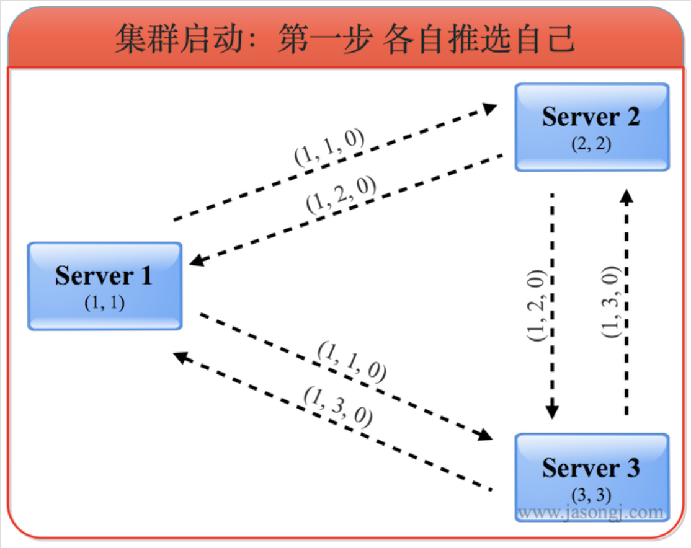

  (1, 1, 0)第一位数代表投出该选票的服务器的logicClock，第二位数代表被推荐的服务器的myid，第三位代表被推荐的服务器的最大的zxid。由于该步骤中所有选票都投给自己，所以第二位的myid即是自己的myid，第三位的zxid即是自己的zxid。

  此时各服务器票箱中只有自己的一票

- 更新选票：服务器收到外部服务器发出的投票时，判断是否更新自己票箱，并进行选票 PK

  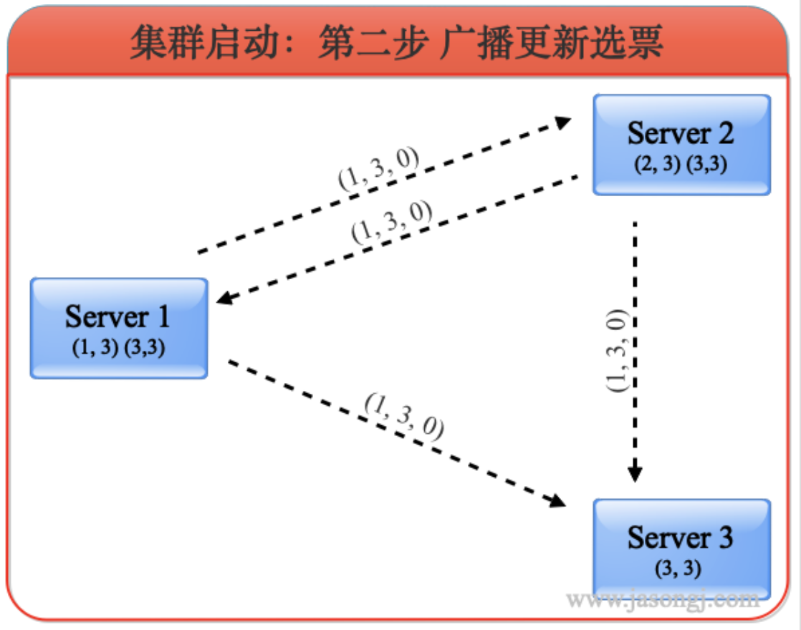

  - 服务器 1收到来自服务器 2 的投票（1，2，0）和来自服务器 3的投票（1，3，0），由于此时所有的 logicClock 和 zxid 都相同，因此按照服务器 ID 更新选票,应该将自己的选票按照服务器3的选票更新为（1, 3, 0），接着将自己更新后的选票广播出去。此时服务器1票箱内的选票为(1, 3)，(3, 3)。

  - 服务器 2

    最开始收到服务器 1 的投票（1，1，0）被忽略，之后收到服务器3的选票后也将自己的选票更新为（1, 3, 0）并存入票箱然后广播。此时服务器2票箱内的选票为(2, 3)，(3, 3)，然后收到服务器 1 再次更新的选票（1，3，0），加入票箱，此时服务器 2 票箱内选票为（1，3）（2，3）（3，3）

  - 服务器 1 再次收到服务器 2 更新的选票（1，3，0），加入自己票箱，此时服务器 1 的票箱为（1，3）（2，3）（3，3）

  - 服务器 3 依照上述规则，无需更新自己的选票，自身票箱为（1，3）（2，3）（3，3）

  - 服务器1与服务器2更新后的选票广播出去后，由于三个服务器最新选票都相同，最后三者的票箱内都包含三张投给服务器3的选票

- 确定角色：根据上述选票，三个服务器一致认为此时服务器3应该是Leader。因此服务器1和2都进入FOLLOWING状态，而服务器3进入LEADING状态。之后Leader发起并维护与Follower间的心跳

#### 4.3.2 Follower 重启

Follower重启，或者发生网络分区后找不到Leader，会进入LOOKING状态并发起新的一轮投票

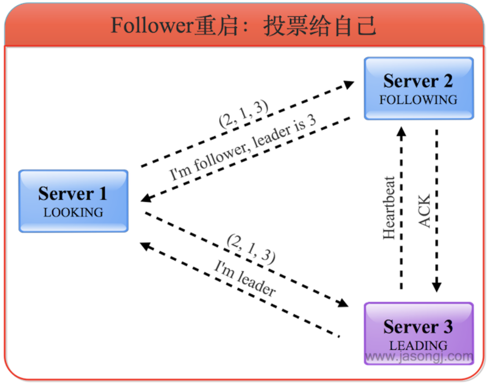

- 发现已有 Leader 后成为 Follower：服务器3收到服务器1的投票后，将自己的状态LEADING以及选票返回给服务器1。服务器2收到服务器1的投票后，将自己的状态FOLLOWING及选票返回给服务器1。此时服务器1知道服务器3是Leader，并且通过服务器2与服务器3的选票可以确定服务器3确实得到了超过半数的选票。因此服务器1进入FOLLOWING状态。

#### 4.3.3 Leader 重启

- Follower 发起新一轮投票：Leader（服务器3）宕机后，Follower（服务器1和2）发现Leader不工作了，因此进入LOOKING状态并发起新的一轮投票，并且都将票投给自己。

- 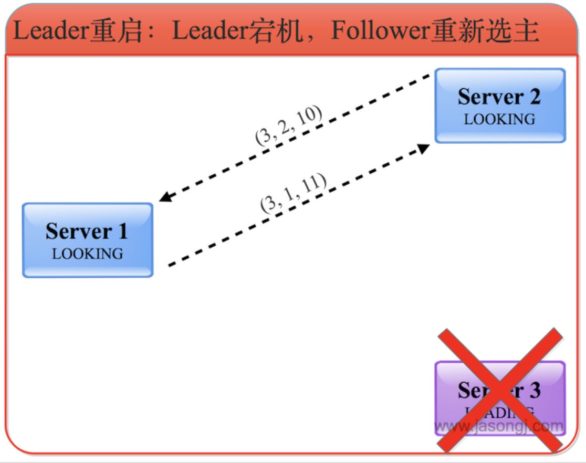

- 广播更新选票

  - 若服务器 1 和 2 的 zxid 相同（eg.leader 宕机前服务器 1 和 2 完全同步），此时选票的更新主要取决于 myid
  - 服务器 1 和 2 的 zxid 不相同，在旧Leader宕机之前，其所主导的写操作，只需过半服务器确认即可，而不需所有服务器确认。换句话说，服务器1和2可能一个与旧Leader同步（即zxid与之相同）另一个不同步（即zxid比之小）。此时选票的更新主要取决于谁的zxid较大【谁的事务进行的快则作为新的 Leader】

- 选出新 Leader:如上图中,服务器 1 的zxid更大,因此选票更新为 1,最终服务器 1 作为新的 Leader

- 旧 Leader 恢复后发起选举：旧的Leader恢复后，进入LOOKING状态并发起新一轮领导选举，并将选票投给自己。此时服务器1会将自己的LEADING状态及选票（3, 1, 11）返回给服务器3，而服务器2将自己的FOLLOWING状态及选票（3, 1, 11）返回给服务器3。如下图所示

  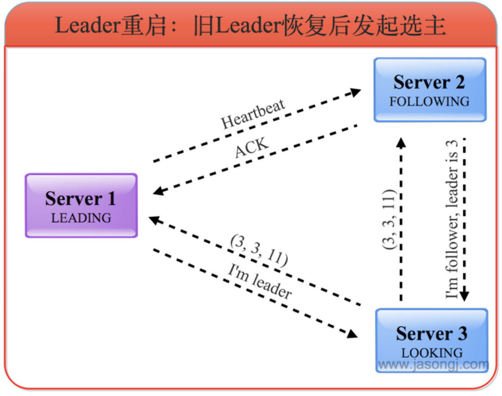

- 旧 Leader 成为 Follower：服务器3了解到Leader为服务器1，且根据选票了解到服务器1确实得到过半服务器的选票，因此自己进入FOLLOWING状态

# 5. 一致性保证

ZAB协议保证了在Leader选举的过程中，已经被Commit的数据不会丢失，未被Commit的数据对客户端不可见。

### 5.1 Commit 的数据不会丢失

#### 5.1.1 宕机前状态

共使用5个Zookeeper服务器。A作为Leader，共收到P1、P2、P3三条消息，并且Commit了1和2，且总体顺序为P1、P2、C1、P3、C2。根据顺序性原则，其它Follower收到的消息的顺序肯定与之相同。其中B与A完全同步，C收到P1、P2、C1，D收到P1、P2，E收到P1，如下图所示。

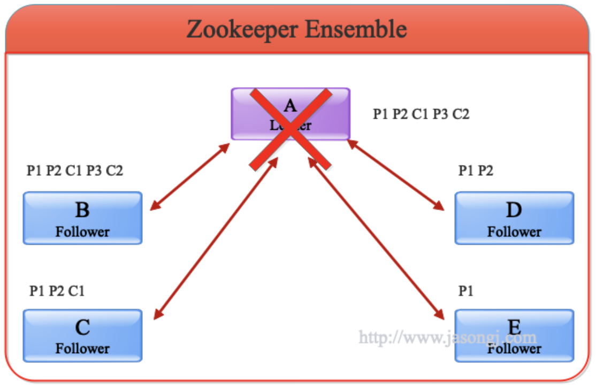

【注】：

- 由于**A没有C3，意味着收到P3的服务器的总个数不会超过一半**，也即包含A在内最多只有两台服务器收到P3。在这里A和B收到P3，其它服务器均未收到P3
- 由于**A已写入C1、C2，说明它已经Commit了P1、P2，因此整个集群有超过一半的服务器，即最少三个服务器收到P1、P2**。在这里所有服务器都收到了P1，除E外其它服务器也都收到了P2

#### 5.1.2 选举新 Leader

旧Leader也即A宕机后，其它服务器根据FastLeaderElection算法选出B作为新的Leader。C、D和E成为Follower且以B为Leader后，会**主动将自己最大的zxid发送给B**，B会将Follower的zxid与自身zxid间的**所有被Commit过的消息同步**给Follower，如下图所示。

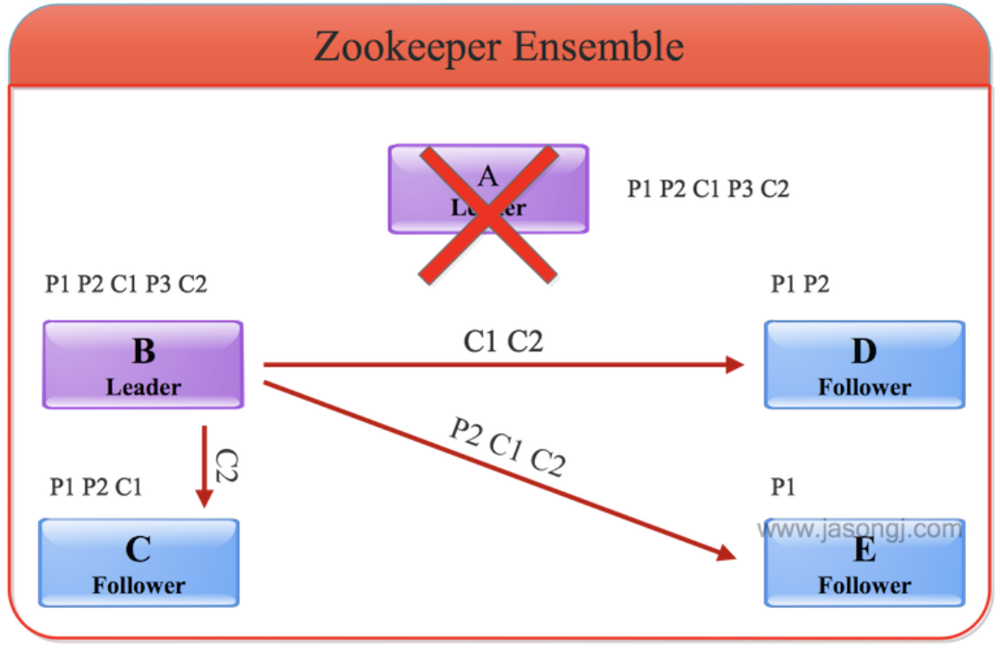

#### 5.1.3 通知 Follower 可对外服务

同步完数据后，B会向D、C和E发送NEWLEADER命令并等待大多数服务器的ACK（下图中D和E已返回ACK，加上B自身，已经占集群的大多数），然后向所有服务器广播UPTODATE命令。收到该命令后的服务器即可对外提供服务。

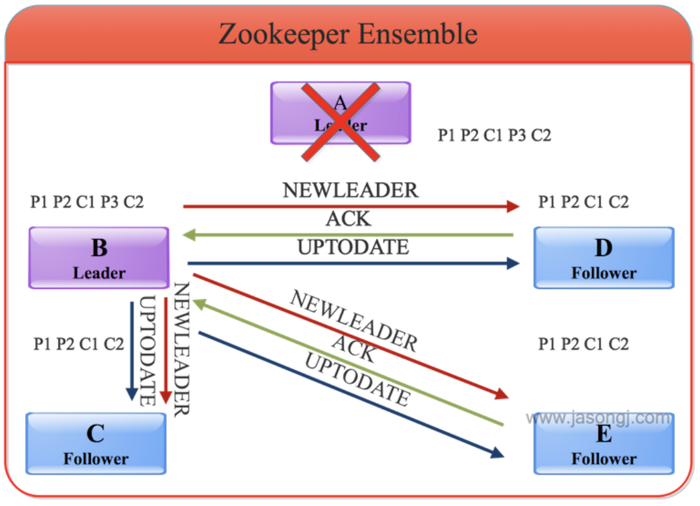

### 5.2 未 Commit 的消息对客户端不可见

​		在上例中，P3未被A Commit过，同时因为没有过半的服务器收到P3，因此B也未Commit P3（如果有过半服务器收到P3，即使A未Commit P3，B会主动Commit P3，即C3），所以它不会将P3广播出去。

​		具体做法是，B在成为Leader后，先判断自身未Commit的消息（P3）是否存在于大多数服务器中从而决定是否要将其Commit。然后B可得出自身所包含的被Commit过的消息中的最小zxid（记为min_zxid）与最大zxid（记为max_zxid）。C、D和E向B发送**自身Commit过的最大消息zxid**（记为max_zxid）以及**未被Commit过的所有消息（记为zxid_set）**。B根据这些信息作出如下操作：

- 如果Follower的max_zxid与Leader的max_zxid相等，说明该Follower与Leader完全同步，无须同步任何数据
- 如果Follower的max_zxid在Leader的(min_zxid，max_zxid)范围内，Leader会通过TRUNC命令通知Follower将其zxid_set中大于Follower的max_zxid（如果有）的所有消息全部删除

上述操作保证了未被Commit过的消息不会被Commit从而对外不可见


